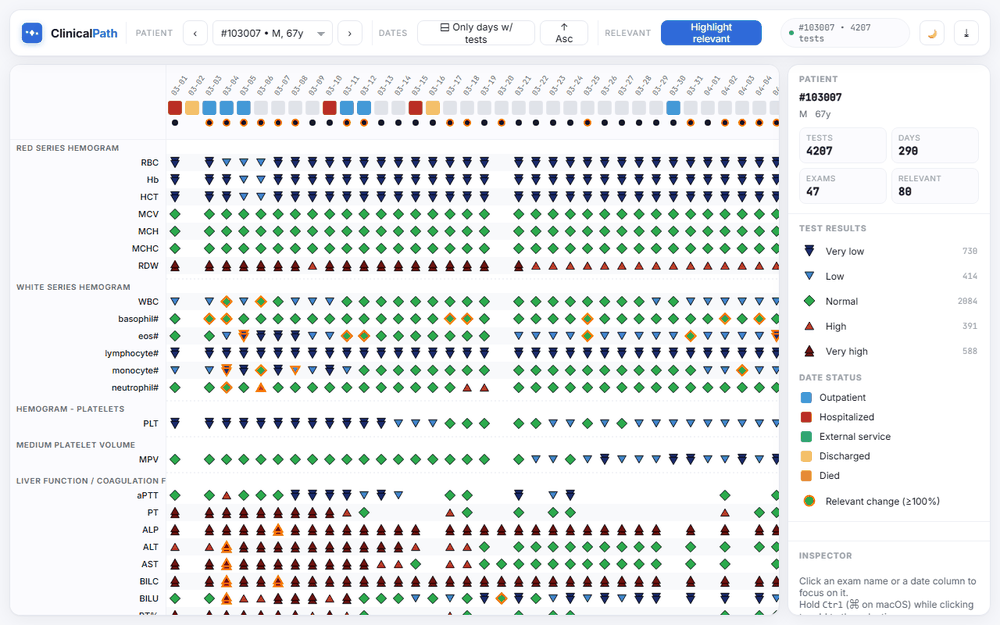

# ClinicalPath

**ClinicalPath** is a freely available visualization system for evaluating
Electronic Health Records (EHRs) in clinical decision-making. It presents a
single patient's test results and clinical history longitudinally, using
colour, shape and a compact timeline so that physicians can read months of
laboratory data at a glance and identify trends, abnormalities and relevant
changes that drive diagnosis and treatment. The system was designed in close
collaboration with domain experts in biomedical informatics and medicine.

> 🌐 **New — try ClinicalPath in your browser, no install required:**
> **[claudiodgl.github.io/ClinicalPath_web](https://claudiodgl.github.io/ClinicalPath_web/)**
> (source: [claudiodgl/ClinicalPath_web](https://github.com/claudiodgl/ClinicalPath_web)).

---

## Contents

- [Demonstration video](#demonstration-video)
- [IEEE VIS 2022 talk](#ieee-vis-2022-talk)
- [Visualization at a glance](#visualization-at-a-glance)
- [Download & install (Java release)](#download--install-java-release)
- [Web version](#web-version)
- [Dataset](#dataset)
- [Published paper](#published-paper)
- [Citation](#citation)

---

## Demonstration video

Short walkthrough of the main functionalities of the ClinicalPath system:

https://user-images.githubusercontent.com/2184371/170728069-371fba9e-6e9f-493f-b8fe-08db5e9bcc9d.mp4

## IEEE VIS 2022 talk

Conference presentation by Claudio Linhares at IEEE VIS 2022:

https://user-images.githubusercontent.com/2184371/197344405-e42f7985-8ff4-4241-b338-5fac9f745441.mp4

## Visualization at a glance

Test results and clinical history of patient `1300236`, longitudinally:


- The **time information** above each column encodes the patient's clinical
  status on that day (outpatient, hospitalized, external service,
  discharged, died).
- **Test results** are encoded with both colour and shape (very low / low /
  normal / high / very high) so that abnormality is legible at a glance and
  remains accessible to colour-blind users.
- A grouped row layout (e.g. *Red Series Hemogram*) keeps related exams
  close together, which makes time trends — like the steady RDW increase
  visible at the right of the figure — easy to spot.

## Download & install (Java release)

The Java desktop release runs on any platform with a Java Runtime.

1. Install Java JRE (8 or newer) — [java.com/en/download](https://java.com/en/download).
2. Download the latest release:
   [`ClinicalPath_v2.0.zip`](https://github.com/claudiodgl/ClinicalPath/blob/main/ClinicalPath_v2.0.zip).
3. Extract the archive anywhere.
4. Double-click `ClinicalPath.jar` to launch the application
   (or run `java -jar ClinicalPath.jar` from a terminal).

## Web version

A browser-based re-implementation of the same visualization runs entirely in
your browser — **no Java, no install.** It is the recommended starting point
for new users.

### ▶️ [Try it live — claudiodgl.github.io/ClinicalPath_web](https://claudiodgl.github.io/ClinicalPath_web/)



The web version uses **D3.js** on the frontend and **FastAPI** on the backend,
runs on the same `ClinicalPath_v2.0` dataset, and adds modern interactions:
multi-selection, click-and-drag panning, a light/dark theme, draggable
per-exam line-chart popups, and SVG export.

- 🌐 **Live demo:** <https://claudiodgl.github.io/ClinicalPath_web/>
- 📦 **Source code:** [**claudiodgl/ClinicalPath_web**](https://github.com/claudiodgl/ClinicalPath_web)

## Dataset

ClinicalPath ships with nine anonymised patients from the
[FAPESP COVID-19 Data Sharing/BR Repository](https://repositoriodatasharingfapesp.uspdigital.usp.br),
which contains laboratory test results for COVID-19 patients (and
suspected cases) from five Brazilian healthcare institutions. The included
patient ids are:

```
103007  387938  1232020  1262563  1300236  1395592  1570650  1591522  1678020
```

Additional patients can be added by following the data preparation pipeline
described in the paper.

## Published paper

The system was published in the IEEE Transactions on Visualization and
Computer Graphics (TVCG) journal in 2022.

- **DOI:** [10.1109/TVCG.2022.3175626](https://doi.org/10.1109/TVCG.2022.3175626)
- **Open-access preprint:** [arXiv:2205.13570](https://doi.org/10.48550/arXiv.2205.13570)

## Citation

If you use ClinicalPath in academic work, please cite:

```bibtex
@ARTICLE{9779066,
  author  = {Linhares, Claudio D. G. and Lima, Daniel M. and Ponciano, Jean R.
             and Olivatto, Mauro M. and Gutierrez, Marco A. and Poco, Jorge
             and Traina, Caetano and Traina, Agma Juci Machado},
  journal = {IEEE Transactions on Visualization and Computer Graphics},
  title   = {ClinicalPath: a Visualization tool to Improve the Evaluation of
             Electronic Health Records in Clinical Decision-Making},
  year    = {2022},
  pages   = {1-16},
  doi     = {10.1109/TVCG.2022.3175626}
}
```
